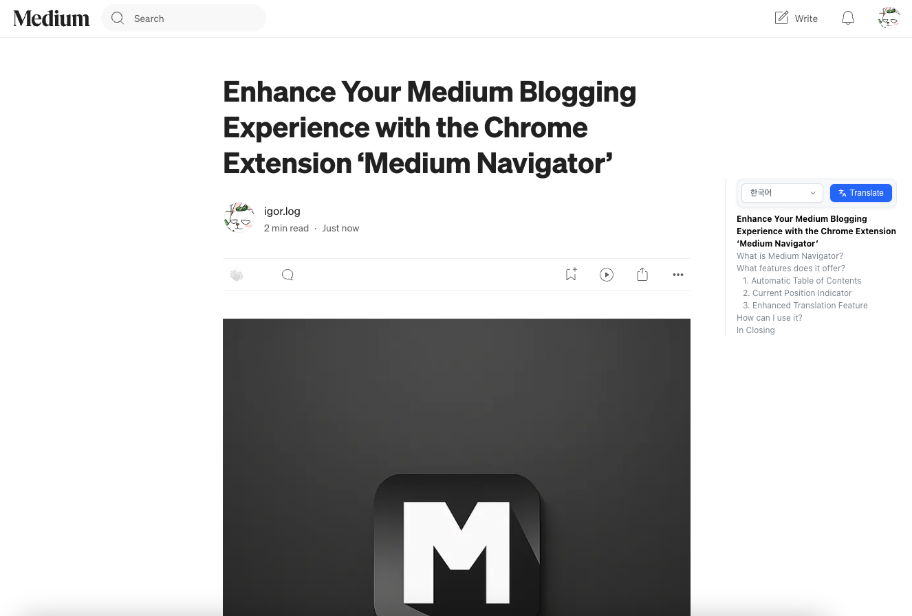

  
  <h1>Medium Navigator</h1>
  
Medium 블로그를 더 쉽고 편리하게 탐색할 수 있는 크롬 확장 프로그램

  
  
  

## 소개

**Medium Navigator**는 Medium 블로그를 읽는 사용자들을 위한 크롬 확장 프로그램입니다. 게시물을 읽는 동안 편리하게 문서의 섹션을 탐색할 수 있게 해주어 독서 경험을 향상시킵니다.

## 주요 기능

- Medium 게시물의 모든 헤딩을 자동으로 감지하여 네비게이션 바로 표시
- 현재 보고 있는 섹션을 자동으로 강조 표시
- 페이지 하단에 도달했을 때 자동으로 네비게이션 바 숨김 기능
- 글 작성/수정 페이지에서는 자동으로 비활성화
- 포스트 내용 번역 기능 (코드 블록은 번역에서 제외)

## 설치 방법

## 스크린샷

  

## 업데이트 기록

### 2.0.1
- 특정 페이지에서 class name 충돌 문제를 수정

### 2.0.0
- 주요 기능 및 안정성 전반을 대폭 개선
- 번역 기능 추가: Medium 게시물 본문의 텍스트를 선택한 언어로 번역 (코드 블록은 번역 대상에서 제외)

### 1.3.0
- Medium 글 작성/수정 페이지에서 네비게이션 기능을 비활성화하도록 변경

### 1.2.2
- 게시물 수정 페이지에서 네비게이션이 예기치 않게 작동하던 문제 해결

### 1.2.1
- TypeScript로 전환하여 안정성과 성능 향상
- 게시물 작성 페이지에서 네비게이션이 예기치 않게 작동하던 문제 해결

### 1.2.0
- 현재 보고 있는 태그를 네비게이션 바에서 굵은 글씨로 표시
- 페이지 하단(footer)에 도달 시 네비게이션 바가 점차 사라지는 애니메이션 추가

### 1.1.1
- 페이지 하단(footer) 감지 방식을 개선
- 스크롤 스타일 문제가 발생하던 부분 수정

### 1.1.0
- 사용자가 페이지 하단에 도달할 때 네비게이션 바가 사라지는 기능 추가

### 1.0.0
- 최초 릴리스
- Medium 사용자 경험을 개선하기 위한 글 네비게이션 확장 프로그램 출시

## 라이선스

이 프로젝트는 MIT 라이선스에 따라 배포됩니다. 자세한 내용은 [LICENSE](LICENSE) 파일을 참조하세요.

---

  Made with ❤️ by Igor

